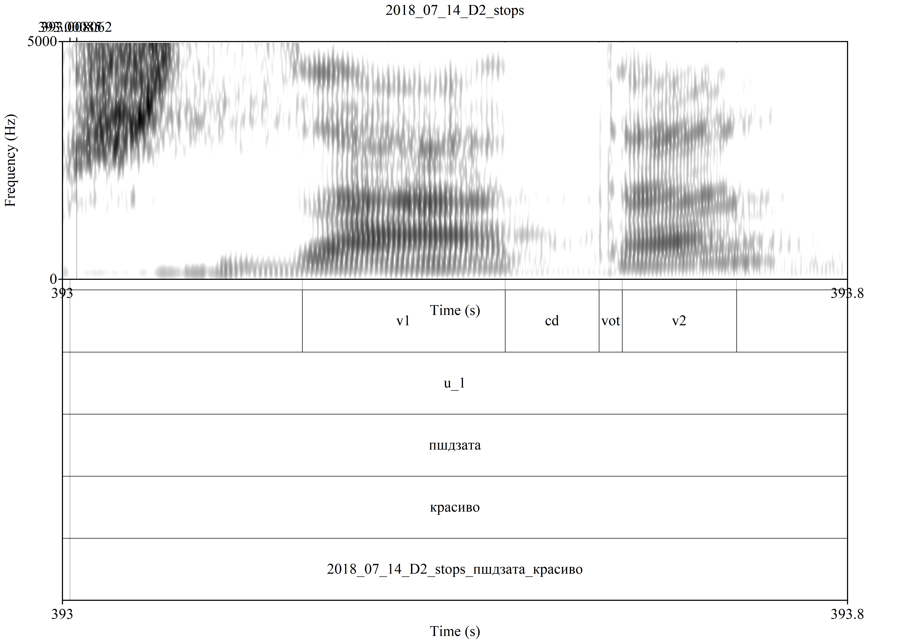

```{r setup, include=FALSE}
options(htmltools.dir.version = FALSE)
knitr::opts_chunk$set(echo = FALSE, message = FALSE,
                      warning= FALSE,
                      Encoding = "UTF-8")
#setwd("https://github.com/tatianamamonova/2018_Abaza_VOT")
library(tidyverse)
library(ggplot2)
library(rmarkdown)
library(utf8)
theme_set(theme_bw())
```


# VOT

In 1964, Lisker and Abramson: 

>"the timing of glottal pulsing relative to supraglottal articulation would account for the great majority of homorganic consonantal distinctions traditionally said to depend on voicing, aspiration, "tensity", and the like" (Abramson and Whalen 2017).
 
Abramson & Whalen (2017) argue that VOT is a cross-linguistically useful (and simple) measure, even if not a universal discriminator.

# 

Considering a sample of languages, (Ladefoged & Cho 1999) show that VOT measurements do not directly depend on sound types and oppositions. Below is the sub-sample that has ejectives: 

```{r}
read_tsv("ladefoged_cho_without_abaza.txt") %>% 
  mutate(x = factor(paste(lang, sound), levels = paste(lang, sound)),
         x = reorder(x, value)) %>% 
  ggplot(aes(x, value, fill = lang))+
  geom_col(show.legend = FALSE)+
  coord_flip()+
  labs(x = "", y = "mean VOT (ms)")+
  theme(text = element_text(size=15))
```

# Ladefoged and Cho graph with data Abaza speakers

In our study, we want to consider how Abaza consonants perform in terms of temporal structuring (VOT etc.), comparing voiceless and ejective stops.

```{r}
read_tsv("ladefoged_cho.txt") %>% 
  mutate(x = factor(paste(lang, sound), levels = paste(lang, sound)),
         x = reorder(x, value)) %>% 
  ggplot(aes(x, value, fill = lang))+
  geom_col(show.legend = FALSE)+
  theme_bw()+
  coord_flip()+
  labs(x = "", y = "mean VOT (ms)")+
  theme(text = element_text(size=15))
  fig.pose = "R"
```


# Data. Featuers of stops

* POA: labial, dental, velar, uvular

* Manner: stops

* Phonation type: voiceless, ejective

# Data. Measurments

* Previous vowel duration (v1)

* Closure duration (cd)

* Voice Onset time (vot)

* Following vowel duration (v2)

# Measurments

Examples of annotation in Praat

{#id .class width=570 height=500px}     {#id .class width=570 height=500px}

# Data. List of words

* Words with two syllables

* Phonectic context aCa

* Stressed position not controlled

* Eleciting words by a Russian translation

* Three repetition followed by a carrier phrase

* Four female speakers


# List of words

* List of words was generated automalically from dictionary with R script


```{r}
df <- read_csv("data/single_stops_after_cleaning.txt")

names(df) <- c("utterance", "file_name", "annotation", "duration_ms", "start", "end")

df %>% 
  mutate(word = str_extract(file_name, "_[AaА_Яа-я1I]*_"),
         word = str_replace_all(word, "_", ""),
         word = str_replace_all(word, "a", "а"),
         word = str_replace_all(word, "A", "А")) ->
  df


df %>% 
  mutate(vow_p = str_extract(word, "[ёуеыаоэяиюЁУЕЫАОЭЯИЮ]"),
         vow_n = str_extract(stringi::stri_reverse(word), "[ёуеыаоэяиюЁУЕЫАОЭЯИЮ]"),
         word = str_replace(word, "^у", "^w"),
         cons_cyr = str_extract(word, "[ёуеыаоэяиюЁУЕЫАОЭЯИЮ].*[ёуеыаоэяиюЁУЕЫАОЭЯИЮ]"),
         cons_cyr = str_replace_all(cons_cyr, "[ёуеыаоэяиюЁУЕЫАОЭЯИЮ]", "")) %>%
  na.omit() %>% 
  left_join(data_frame(cons_cyr = c("т", "б", "г", "д", "хъ", "къ", "п", "пI", "кIь", "тI", "гь", "кI", "кь"),
           cons_ipa = c("t", "b", "ɡ", "d", "q", "q'", "p", "p'", "kʲ'", "t'", "gʲ", "k'", "kʲ"))) %>% 
  left_join(data_frame(
  cons_ipa = c("t", "b", "ɡ", "d", "q", "q'", "p", "p'", "kʲ'", "t'", "gʲ", "k'", "kʲ"),
  poa = c("dental", "labial", "velar", "dental", "uvular", "uvular", "labial",  "labial",  "velar_pal",  "dental",  "velar_pal",  "velar",  "velar_pal"),
  phonation = c("voiceless", "voiced", "voiced", "voiced", "voiceless", "ejective", "voiceless", "ejective", "ejective", "ejective", "voiced", "ejective", "voiceless"),
  articulation = c("plain", "plain", "plain", "plain", "plain", "plain", "plain", "plain", "palatalised", "plain", "palatalised", "plain", "palatalised"))) %>% 
    mutate(cons_ipa = factor(cons_ipa, levels = c("p", "p'", "b", "t", "t'", "d",  "k'", "ɡ", "k", "kʲ", "kʲ'", "gʲ",  "q", "q'")),
           annotation = if_else(phonation == "voiced" & annotation == "vot", "", annotation),
           annotation = if_else(phonation == "voiced" & annotation == "cd", "vot", annotation),
           duration_ms = if_else(phonation == "voiced" & annotation == "vot", -duration_ms, duration_ms)) %>% 

# ... это фиаско: гIхъ, ггIхъ, дгь, ддз, ркъ, тр, тртI
  filter(!str_detect(cons_cyr, "гIхъ|ггIхъ|дгь|ддз|ркъ|тр|тртI"),
         !str_detect(vow_p, "у|и|ы"),
         !str_detect(vow_n, "у|и|ы")) %>% 
  mutate(poa = factor(poa, levels = c("labial", "dental", "velar", "velar_pal", "uvular"))) ->
  df

df %>% 
  mutate(stressed = str_extract(annotation, "[12]")) %>% 
  filter(!is.na(stressed)) %>% 
  select(word, stressed) %>% 
  left_join(df)->
  df

df %>% 
  mutate(speaker = str_extract(file_name, "D[0-9]")) ->
  df
  
df %>% 
  distinct(word, cons_ipa, cons_cyr, poa) %>% 
  count(cons_ipa, poa, sort = TRUE) %>% 
  rbind(data_frame(cons_ipa = "k", poa = "velar", n = 0)) %>% 
  ggplot(aes(cons_ipa, n, label = n, fill = poa)) +
  geom_col()+
  geom_text(aes(y = n + 1))+
  labs(x = "", y = "")

```


# Analysis

* Data were annotated in Praat

* Extracted with Praat script

* Analysed and visualized with R by G. Moroz

# Absolute values of CD

```{r}
df %>%
  filter(!str_detect(annotation, "v[12]"),
         str_detect(annotation, "cd")) %>% 
  ggplot(aes(cons_ipa, duration_ms, fill = phonation))+
  geom_boxplot()+
  geom_point()+
  facet_wrap(~annotation, scales = "free_y")+
  theme(legend.position = "bottom")+
  labs(x = "", y = "duration (ms)")
  

```

# Absolute values of VOT

```{r}
df %>%
  filter(!str_detect(annotation, "v[12]"),
         str_detect(annotation, "vot")) %>% 
  ggplot(aes(cons_ipa, duration_ms, fill = phonation))+
  geom_boxplot()+
  geom_point()+
  facet_wrap(~annotation, scales = "free_y")+
  theme(legend.position = "bottom")+
  labs(x = "", y = "duration (ms)")+
  theme(text = element_text(size=15))

```

# Absolute values of CD~VOT

```{r}
df %>% 
  select(-stressed) %>% 
  distinct() %>% 
  filter(str_detect(annotation, "cd|vot")) %>% 
  select(annotation, duration_ms, file_name, utterance, speaker, poa, phonation) %>%
  spread(annotation, duration_ms) %>% 
  ggplot(aes(cd, vot, color = phonation))+
  geom_point()+
  facet_grid(speaker~poa, scales = "free")+
  stat_ellipse()+
  theme(legend.position = "bottom")+
  labs(x = "CD (ms)", y = "VOT (ms)")
```

# Relative values: CD / CD + VOT

```{r}

df %>%
  filter(str_detect(annotation, "cd|vot"),
         !str_detect(phonation, "voiced")) %>% 
  group_by(utterance, file_name) %>% 
  mutate(rate = duration_ms/sum(duration_ms)) %>% 
  filter(annotation == "cd") %>% 
  ggplot(aes(cons_ipa, rate, fill = phonation))+
  geom_boxplot()+
  geom_point()+
  facet_wrap(~speaker, scales = "free")+
  theme(legend.position = "bottom")+
  labs(y = "relative value CD", x = "")

```

# Relative values: VOT / CD + VOT

```{r}

df %>%
  filter(str_detect(annotation, "cd|vot"),
         !str_detect(phonation, "voiced")) %>% 
  group_by(utterance, file_name) %>% 
  mutate(rate = duration_ms/sum(duration_ms)) %>% 
  filter(annotation == "vot") %>% 
  ggplot(aes(cons_ipa, rate, fill = phonation))+
  geom_boxplot()+
  geom_point()+
  facet_wrap(~speaker, scales = "free")+
  theme(legend.position = "bottom")+
  labs(y = "relative value VOT", x = "")

```


# Generalized linear mixed model

```{r}
df %>% 
  select(-stressed) %>% 
  distinct() %>% 
  filter(str_detect(annotation, "cd|vot"),
         poa != "velar") %>% 
  select(annotation, duration_ms, file_name, utterance, speaker, poa, phonation) %>%
  spread(annotation, duration_ms) %>% 
  mutate(phonation = factor(phonation),
         cd = scale(cd),
         vot=scale(vot)) ->
  df_for_glm

df_for_glm %>% 
  ggplot(aes(cd, vot, color = phonation))+
  geom_point()+
  facet_grid(speaker~poa, scales = "free")+
  stat_ellipse()+
  theme(legend.position = "bottom")+
  labs(x = "CD (ms)", y = "VOT (ms)")

```


# Generalized linear mixed model

```{r}

library(lme4)
fit_1 <- glmer(phonation ~ cd+vot+poa+(1|speaker), 
             data=df_for_glm,
             family = "binomial",
             glmerControl(optimizer="bobyqa", optCtrl=list(maxfun=1000000)))

summary(fit_1)
```


# Thank you!

 Tatiana Mamonova (t_mamonovaa@outlook.com)
